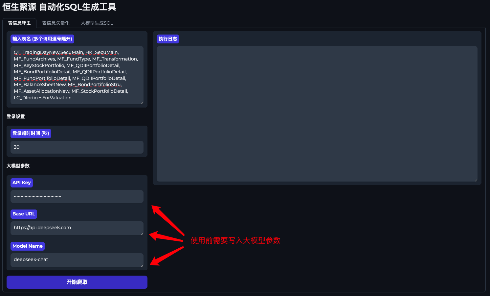
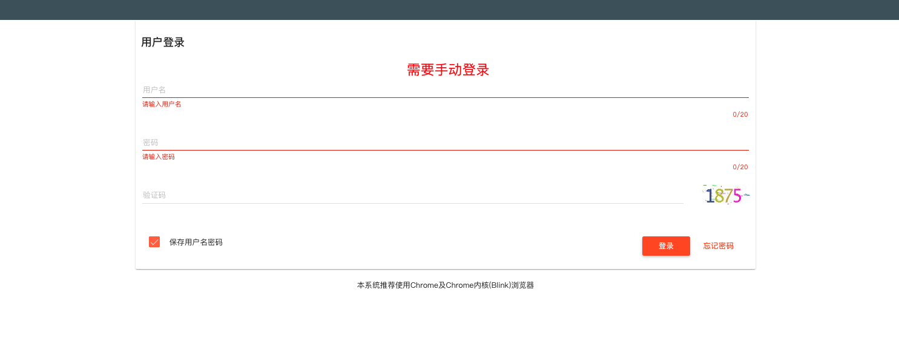
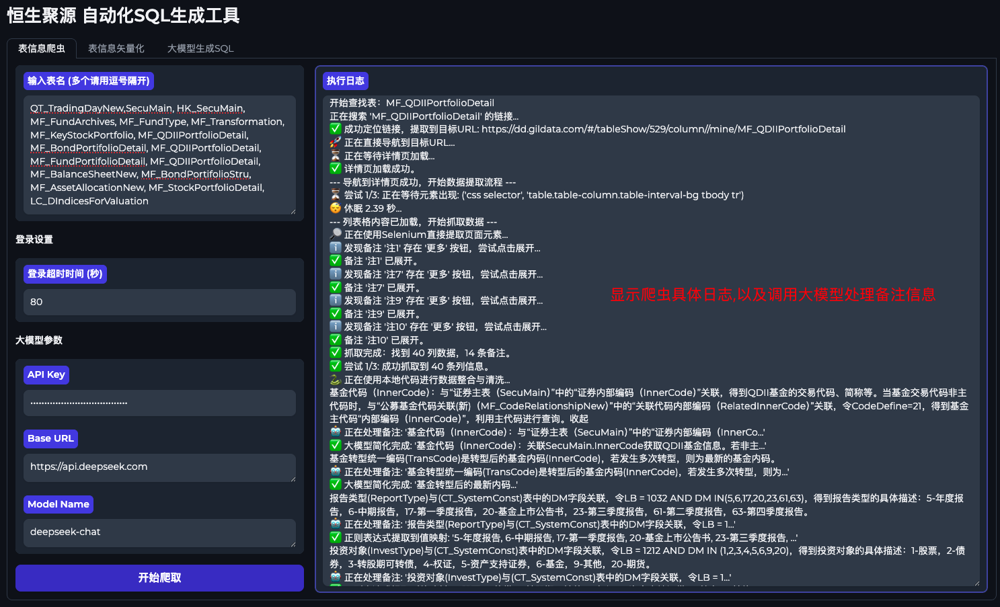
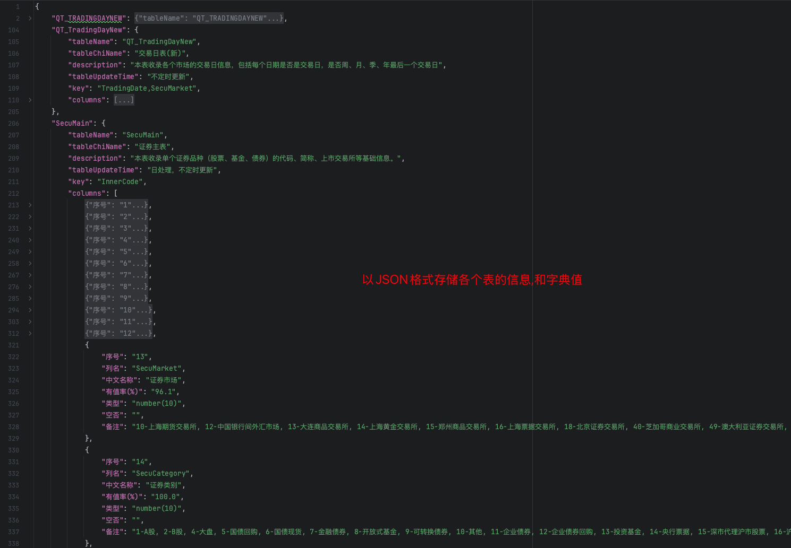
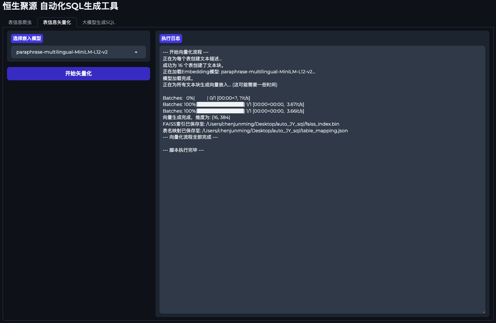
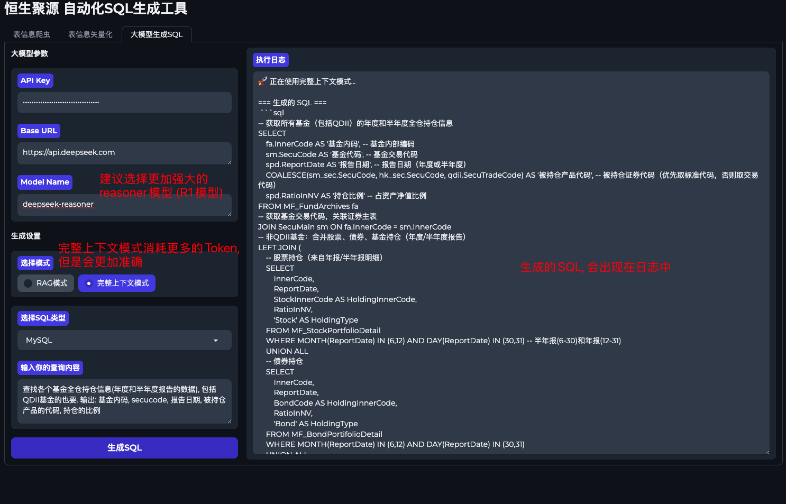
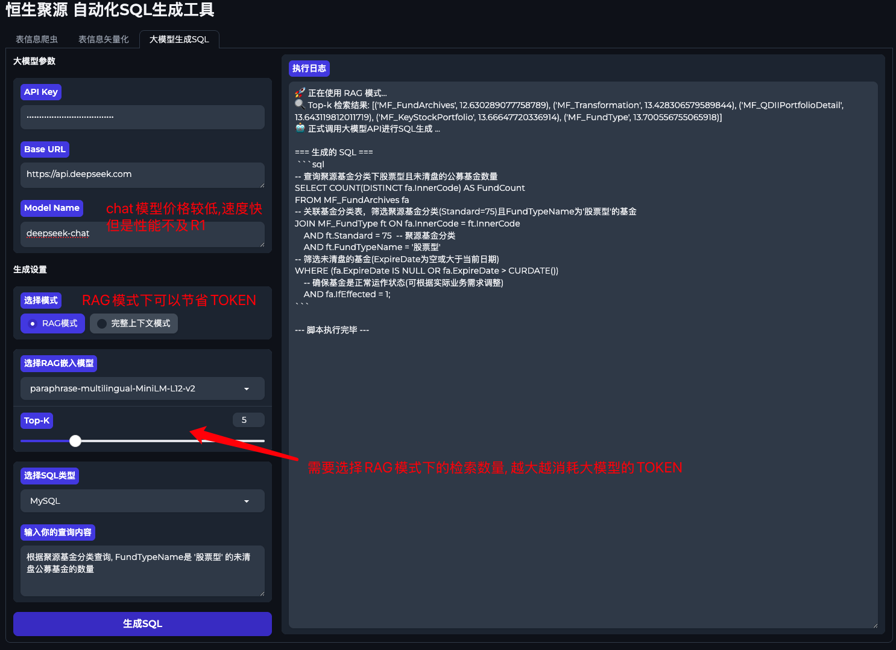
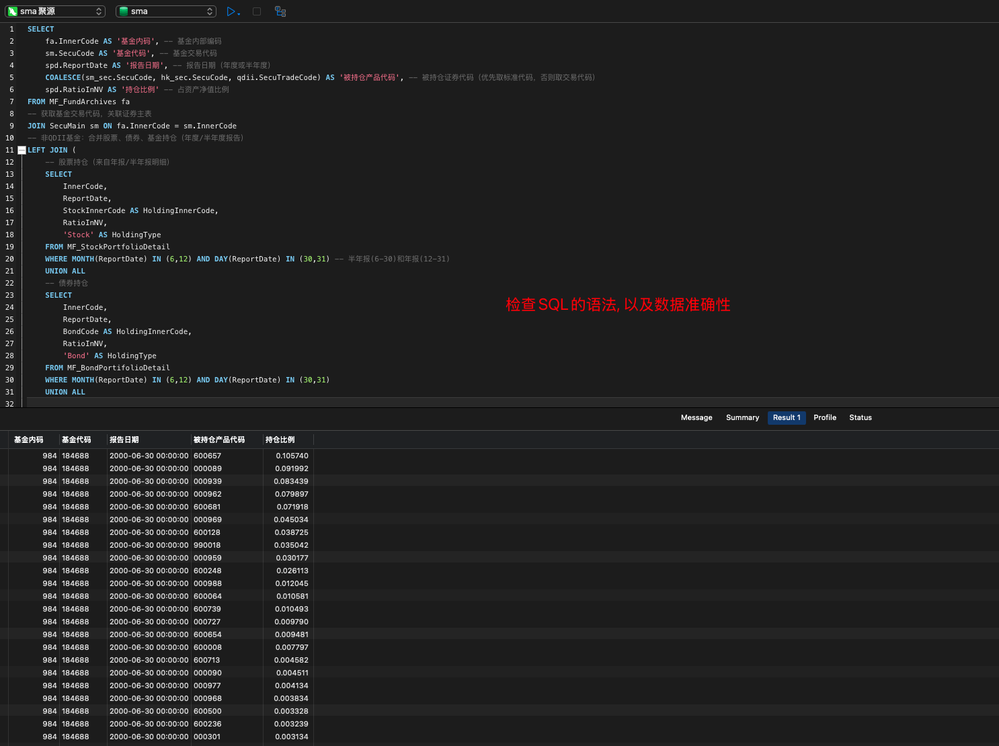

# 聚源数据库 - 智能SQL生成工具

这是一个基于大模型（LLM）和检索增强生成（RAG）技术的智能SQL生成工具，旨在帮助用户通过自然语言查询快聚源数据库速生成高质量的SQL语句。它集成了表信息爬取、数据向量化和SQL生成三大核心功能，并提供了一个用户友好的 Gradio Web 界面。

## 核心功能

### 1. 表信息爬虫 (`table_info_spider.py`)

*   **功能**: 自动从聚源字典表 (dd.gildata.com) 爬取指定数据库表的详细元数据，包括表中文名、描述、主键、字段信息（列名、数据类型、备注）等。
*   **特点**: 支持手动登录、智能定位页面元素（通过LLM辅助）、备注信息LLM简化，并将爬取结果保存为 `table_definitions.json` 文件。

### 2. 表信息向量化 (`vectorize_tables.py`)

*   **功能**: 读取 `table_definitions.json` 中保存的表元数据，使用 Sentence-Transformers 模型将其转换为向量嵌入（Embeddings）。
*   **特点**: 利用 FAISS 库构建高效的向量索引 (`faiss_index.bin`) 和表名映射 (`table_mapping.json`)，为后续的 RAG 检索提供基础。

### 3. SQL生成 (`generate_sql.py`)

*   **功能**: 根据用户的自然语言查询和数据库元数据，通过大模型生成 MySQL 或 Oracle 语法的 SQL 语句。
*   **特点**: 
    *   支持 **RAG 模式**: 优先检索与用户查询最相关的 Top-K 表定义作为上下文，减少 LLM 的输入 Token 数量，提高效率和准确性。
    *   支持 **完整上下文模式**: 将所有表定义作为上下文提供给 LLM。
    *   生成的 SQL 包含详细注释，解释关键逻辑。
    *   内置了针对聚源数据特点的 LLM 提示词优化，例如自动转换中文描述为数字代码。

### 4. Gradio Web 界面 (`app.py`)

*   **功能**: 提供一个直观的 Web UI，将上述三个核心功能集成在一个应用中，方便用户操作。
*   **特点**: 
    *   包含“表信息爬虫”、“表信息向量化”和“大模型生成SQL”三个独立的标签页。
    *   支持配置 LLM API Key、Base URL、模型名称等参数。
    *   实时显示脚本执行日志。
    *   自动保存 LLM 配置到 `gradio_config.json`。

## 安装与配置

1.  **克隆项目** (如果尚未克隆):
    ```bash
    git clone https://github.com/ScreenToGifPython/auto_JY_sql.git
    cd auto_JY_sql
    ```

2.  **创建并激活虚拟环境** (推荐):
    ```bash
    python -m venv venv
    # macOS/Linux
    source venv/bin/activate
    # Windows
    .\venv\Scripts\activate
    ```

3.  **安装依赖**: 
    本项目依赖以下 Python 库。请确保您的环境中已安装它们。建议使用 `pip` 安装：
    ```bash
    pip install gradio subprocess faiss-cpu numpy sentence-transformers openai httpx selenium beautifulsoup4 webdriver-manager pandas
    ```
    *   **注意**: `faiss-cpu` 是 FAISS 的 CPU 版本。如果您有 GPU 并且希望使用 GPU 加速，可以安装 `faiss-gpu`。

4.  **LLM 配置**: 
    在 `app.py` 运行后，您可以在 Gradio 界面中配置您的 LLM API Key、Base URL 和模型名称。这些配置将自动保存到 `gradio_config.json`。
    *   `generate_sql.py` 中也包含默认配置，但 Gradio 界面中的输入会覆盖它们。

## 使用指南

1.  **启动应用**: 
    ```bash
    python app.py
    ```
    应用启动后，会在浏览器中打开 Gradio 界面。

2.  **表信息爬取**: 
    *   切换到“**表信息爬虫**”标签页。
    *   在“输入表名”文本框中输入要爬取的表名，多个表名用逗号隔开。
    *   配置“登录超时时间”和“大模型参数”。
    *   点击“**开始爬取**”。
    *   **重要**: 脚本会打开一个 Chrome 浏览器窗口，您需要在该窗口中手动完成聚源字典表的登录。脚本会等待您登录成功。
    *   爬取完成后，表定义将保存到项目根目录的 `table_definitions.json` 文件中。
    
    
    
    

3.  **表信息向量化**: 
    *   切换到“**表信息向量化**”标签页。
    *   选择用于生成嵌入的“嵌入模型”（默认为 `paraphrase-multilingual-MiniLM-L12-v2`）。
    *   点击“**开始矢量化**”。
    *   成功后，将生成 `faiss_index.bin` (FAISS 索引文件) 和 `table_mapping.json` (表名映射文件)。
    

4.  **大模型生成SQL**: 
    *   切换到“**大模型生成SQL**”标签页。
    *   配置“大模型参数”（API Key, Base URL, Model Name）。
    *   选择“**RAG模式**”或“**完整上下文模式**”。
        *   如果选择 RAG 模式，请选择“RAG嵌入模型”并设置“Top-K”值。
    *   选择“SQL类型”（MySQL 或 Oracle）。
    *   在“输入你的查询内容”文本框中输入您的自然语言查询。
    *   点击“**生成SQL**”。
    *   生成的 SQL 语句将显示在“执行日志”区域。
    
    
    

## 项目结构

```
auto_JY_sql/
├── app.py                  # Gradio Web 界面主程序
├── table_info_spider.py    # 表信息爬虫脚本
├── vectorize_tables.py     # 表信息向量化脚本
├── generate_sql.py         # SQL生成核心逻辑脚本
├── gradio_config.json      # Gradio 界面配置（自动生成和保存）
├── table_definitions.json  # 爬取到的表定义数据（由 table_info_spider.py 生成）
├── faiss_index.bin         # FAISS 向量索引文件（由 vectorize_tables.py 生成）
├── table_mapping.json      # 表名与索引的映射文件（由 vectorize_tables.py 生成）
└── README.md               # 本说明文档
```

## 注意事项

*   **登录**: 爬虫功能需要您手动在弹出的浏览器窗口中完成登录。
*   **网络**: 确保您的网络连接稳定，以便访问聚源字典表和 LLM 服务。
*   **API Key**: 保护好您的 LLM API Key，不要将其泄露。
*   **模型**: `generate_sql.py` 和 `table_info_spider.py` 中的 LLM 模型配置需要与您使用的 LLM 服务兼容。
*   **调试**: 如果遇到问题，可以查看 Gradio 界面中的“执行日志”或命令行输出，以获取更多信息。`table_info_spider.py` 在失败时会保存调试用的 HTML 文件。
*   **聚源常用表**: `QT_TradingDayNew, SecuMain, HK_SecuMain, MF_FundArchives, MF_FundType, MF_Transformation, MF_KeyStockPortfolio, MF_QDIIPortfolioDetail, MF_BondPortifolioDetail, MF_QDIIPortfolioDetail, MF_FundPortifolioDetail, MF_QDIIPortfolioDetail, MF_BalanceSheetNew, MF_BondPortifolioStru, MF_AssetAllocationNew, MF_StockPortfolioDetail, LC_DIndicesForValuation, FP_ProfitDistribution, FP_NetValue, FP_NetValueRe, FP_SharesChange, FP_Performance, FP_ReturnRank, FP_AssetAllocation, FP_PortfolioDetails, FP_NotTextAnnouncement, FP_NotTextAttach, FP_AnnClassifi, FP_SeriesTagChange, FP_TagChange, Bond_Code, Bond_BasicInfo, Bond_Size, Bond_InterestRate, Bond_FRNRefRate, Bond_ConceptNature, Bond_CodeRelated, Bond_ExchangeQuote, Bond_ExchangeQuoteFI, Bond_CBYCurveInfo` 
